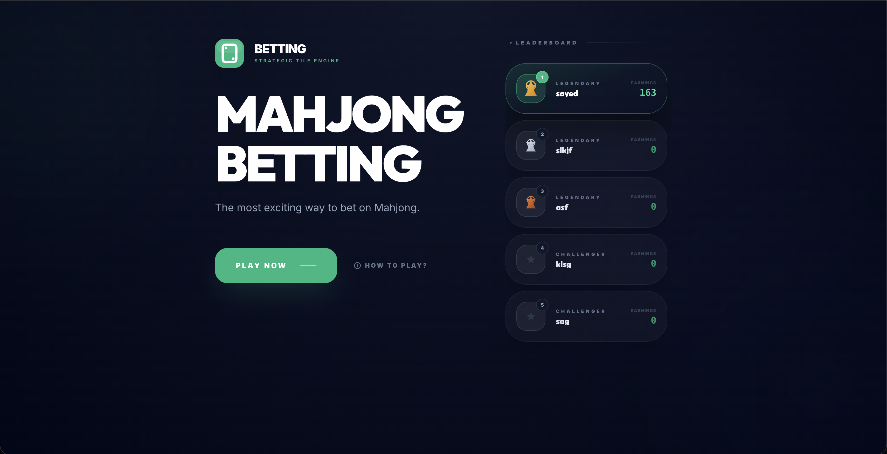
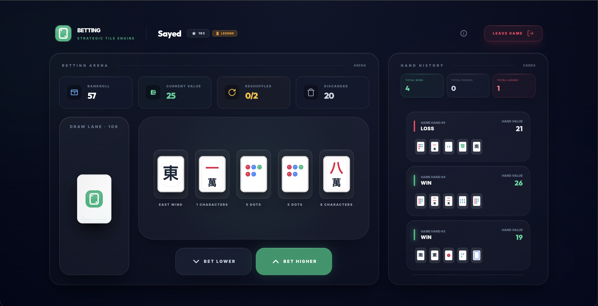
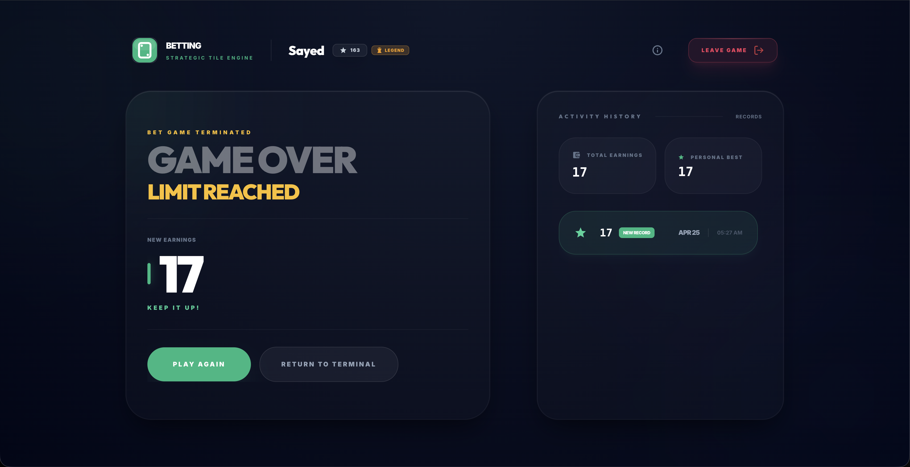
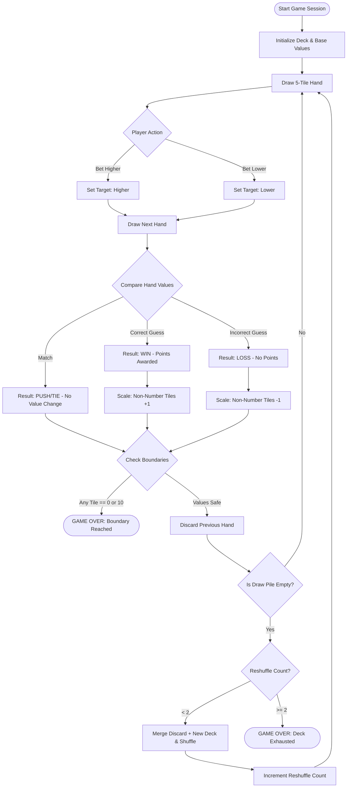
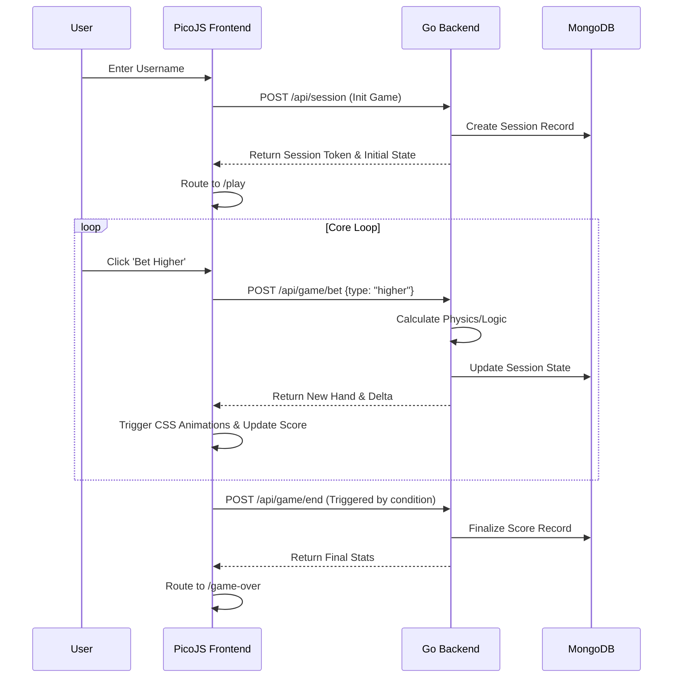
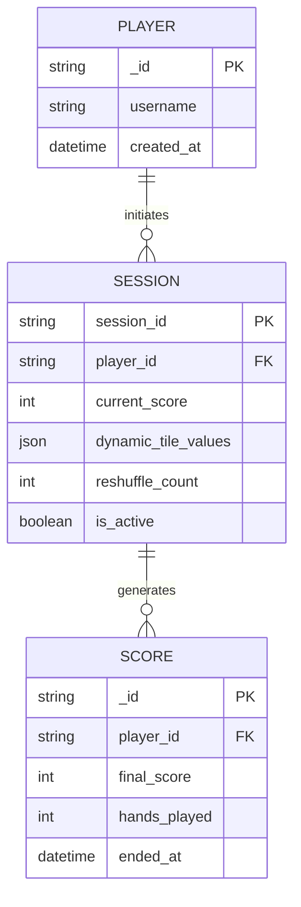

#  Hand Betting Game

A Mahjong betting engine built for a technical assessment. The project pairs a concurrent Go backend with a custom-built Virtual DOM framework to keep the UI lightweight and the logic predictable.

[](https://golang.org/)
[](https://developer.mozilla.org/en-US/docs/Web/JavaScript)
[](https://www.mongodb.com/)
[](https://www.docker.com/)
[](https://tailwindcss.com/)
[](https://github.com/sahmedhusain/picojs-framework)

## 📑 Table of Contents
- [📋 Project Overview](#-project-overview)
- [📸 Screenshots](#-screenshots)
- [🏗️ The Decision: Why PicoJS?](#️-the-decision-why-picojs)
- [🏗️ The Approach: Centralized Config](#️-the-approach-centralized-config)
- [🛠️ Tech Stack](#️-tech-stack)
- [📐 Logic & Flow](#-logic--flow)
- [📂 Directory Tree](#-directory-tree)
- [🚀 Setup & Execution](#-setup--execution)
- [⚙️ Environment Variables](#️-environment-variables)
- [🤖 The "Vibe Engineer" Philosophy: AI & Human Collaboration](#-the-vibe-engineer-philosophy-ai--human-collaboration)
- [🧠 Retrospective](#-retrospective)
- [📈 Future Scalability](#-future-scalability)
- [🤝 Contributing](#-contributing)
- [📄 License](#-license)
- [👨‍💻 Author](#-author)

## 📋 Project Overview

The **Hand Betting Game** is a prediction engine where you forecast the relative value of sequential Mahjong hands.

- **The Core Loop**: You get 5 tiles. You predict if the next draw will be "Higher" or "Lower". Bankroll updates based on your accuracy.
- **Dynamic Valuation**: Instead of static points, non-number tiles (Winds & Dragons) scale in real-time. If you win with them in your hand, they get more valuable (+1 globally). If you lose, they decay (-1).
- **Hard Stops**: The game ends if a tile value hits the boundary (0 or 10) or if the deck runs out after 3 full cycles.

## 📸 Screenshots

### 1. Landing & Authentication


---

### 2. Main Betting Arena


---

### 3. Game Over Summary


## 🏗️ The Decision: Why PicoJS?

For this assessment, I decided to step away from React or Vue and use **PicoJS**—a lightweight framework I built from scratch to really dig into how the modern web works under the hood.

### The Reasoning:
Using a popular framework proves I can follow a README; building the framework proves I understand the core mechanics of the browser. Using PicoJS allowed me to:
- **Master the DOM**: Writing my own diffing and patching algorithm made me much more conscious of rendering costs and DOM abstractions.
- **Control the State**: I wanted a predictable, immutable store without the bloat of Redux.
- **Handle the Lifecycle**: Manually managing event delegation and component mounting ensures every byte in the bundle actually serves a purpose.

It’s about building from first principles instead of just "gluing" dependencies together.

## 🛠️ Tech Stack

### Frontend
- **Framework**: PicoJS (Custom VDOM, Router, and Store)
- **Styling**: Tailwind CSS (Utility-first, hardware-accelerated animations)
- **Assets**: SVGs for crisp, responsive tile rendering.

### Backend
- **Language**: Go (Golang)
- **Architecture**: Domain-Driven Design (DDD) with clear separation between handlers and business services.
- **Security**: Basic rate-limiting and session validation for API integrity.
- **Persistence**: MongoDB for document-based storage of game sessions.

## 🏗️ The Approach: Centralized Config

One of the priorities for this project was keeping the UI logic separate from the data. I used a strict constant registry to manage all text, assets, and game domain rules.

### Why this matters:
- **Internationalization (i18n)**: All UI strings live in `text.js`. Swapping languages doesn't require touching a single component.
- **Easy Branding**: All SVG paths are managed in `assets.js`. A logo swap or a shift to a CDN is a one-line change.
- **Consistency**: Game rules (tile values, limits) are defined in `domain.js`. The frontend's math stays perfectly in sync with the backend's validation.
- **Speed**: I can implement global UI changes or new game rules from a single file, which made development much faster and less error-prone.

## 📐 Logic & Flow

### 1. Game Engine Logic


### 2. User Journey (UX Flow)


### 3. Database Schema


## 📂 Directory Tree

```text
├── apps/
│   ├── backend/                 # Go service
│   │   ├── cmd/server/          # Application entrypoint
│   │   └── internal/            # Core backend logic
│   │       ├── config/          # Environment & setup
│   │       ├── handlers/        # HTTP controllers (game, score, session)
│   │       ├── middleware/      # Rate limits, session auth, CORS
│   │       ├── models/          # Data structures & schemas
│   │       ├── repository/      # MongoDB data access layer
│   │       └── services/        # Business logic & game rules
│   └── frontend/                # Vanilla JS / UI App
│       ├── public/assets/       # SVGs, Icons, Audio
│       ├── src/
│       │   ├── engine/          # Game math, tile configuration, deck arrays
│       │   ├── picojs/          # Custom UI Framework Submodule
│       │   ├── services/        # API controllers, state sync, audio handling
│       │   └── ui/              # PicoJS UI Components and Views
│       └── styles/              # Modular CSS
├── docker-compose.yml           # Multi-container orchestration
├── run.sh                       # Developer unified execution script
└── README.md                    
```

## 🚀 Setup & Execution

The app is containerized, so it's pretty easy to get running.

### 📋 Prerequisites

| Requirement | Version | Purpose |
| :--- | :--- | :--- |
| **Docker** | 20.10+ | Containerized orchestration (Recommended) |
| **Go (Golang)** | 1.22+ | Local backend development |
| **Node.js** | 18.x+ | Local frontend development |
| **MongoDB** | 6.0+ | Persistence (if running locally) |

---

### Method 1: The Unified Runner (`run.sh`)

I built a small management script to handle the environment setup and orchestration.

#### **A. Interactive Mode**
Just run the script to see the menu:
```bash
chmod +x run.sh
./run.sh
```

**Interactive Menu Preview:**
```text
    BETTING GAME - MANAGEMENT SHELL       
==========================================
1) Start Services (Dev Mode)
2) Build Services
3) Docker Commands (Up/Down/Build/Logs)
4) Database Tools (Reset/Config/Query)
5) Environment Management (.env Setup/Verify/Update)
6) System Check (Dependencies/Running Services)
0) Exit
==========================================
```

#### **B. Direct CLI Commands**
If you just want to get moving:
```bash
# Start everything in one shot
./run.sh start --all
```

---

### Method 2: Standard Docker Deployment

1. **Env Setup**: `cp .env.example .env`
2. **Launch**: `docker-compose up --build -d`

---

### Method 3: Manual Development

#### **1. Backend (Go)**
```bash
cd apps/backend
go mod tidy
go run cmd/server/main.go
```

#### **2. Frontend (Node.js)**
```bash
cd apps/frontend
npm install
npm run dev
```

## ⚙️ Environment Variables

The project uses a single `.env` file in the root to manage everything.

| Variable | Description |
| :--- | :--- |
| `FRONTEND_PORT` | Vite development server port |
| `BACKEND_PORT` | Go API service port |
| `MONGODB_URI` | MongoDB connection string |
| `MONGODB_NAME` | Database name |
| `ALLOWED_ORIGINS` | CORS policy for API access |
| `ADMIN_RESET_TOKEN` | Token for administrative resets |
| `VITE_API_BASE_URL` | Frontend API proxy path |
| `VITE_LEADERBOARD_INTERVAL`| Leaderboard polling frequency (ms) |
| `VITE_SOUND_DISABLED` | Global audio toggle |

## 🤖 The "Vibe Engineer" Philosophy: AI & Human Collaboration

Transparency is a core value in my engineering practice. While many projects today are built with AI assistance, I believe there is a fundamental distinction between a "Vibe Coder" and a **"Vibe Engineer."**

### The Philosophy
A **Vibe Coder** is someone who prompts an AI and blindly accepts its output without deep comprehension. A **Vibe Engineer** is the architect, the decision-maker, and the lead debugger. In this project, I treated AI as a high-velocity assistant—we worked together, but every line of code moved in the direction **I commanded.**

### 🧠 The Human Element (My Role)
As the architect of this system, I retained absolute control over the high-level design and critical logic:
- **System Architecture**: Designing the bridge between the concurrent Go backend and the custom PicoJS Virtual DOM framework.
- **Database Schema**: Modeling the document-based storage in MongoDB to handle dynamic game states.
- **Mathematical Core**: Defining the game rules, the dynamic scaling (+1/-1) algorithms, and boundary conditions.
- **Technical Decision-Making**: Choosing the right tools for the job and ensuring the final product met the strict technical assessment requirements.

### 🤖 The AI Element (My Assistant)
I utilized AI as a powerful tool to accelerate the actual execution of my intent:
- **Velocity & Boilerplate**: Drastically speeding up the writing of large, repetitive code blocks and tedious mappings (like the `TileConfig.js` SVG registry).
- **Pair-Programming**: Using AI to bounce ideas off of and audit my logic. This collaboration helped spot edge cases—such as the specific "Push/Tie" math—which I then refined and implemented.
- **Documentation**: Generating the Mermaid syntax for the flowcharts in this README based on my architectural descriptions.

### Summary
For me, AI is an accelerator, not a replacement. It removes the friction of "typing" so I can focus more deeply on **thinking** and **engineering.** This project is a demonstration of how a modern developer can leverage AI to deliver high-quality, complex systems with professional-grade speed and human-grade precision.

## 🧠 Retrospective

### Pros
- **Tiny Bundle**: Bypassing heavy frameworks means a lightning-fast time-to-interactive.
- **Total Integration**: Building the game engine alongside the framework meant the state transitions and CSS animations are perfectly in sync.
- **Predictable History**: PicoJS’s store made it easy to track historical tile values for the History Panel.

### Cons
- **Infrastructure Overhead**: No ecosystem meant I had to write my own Hash Router and State Sync services from scratch.
- **Concurrency**: Bridging Go’s strict concurrency with a real-time JS state required a lot of careful planning.

### Lessons Learned
This project was a great way to practice bridging a vanilla JS frontend with a Go backend. 
- **Monorepo Orchestration**: This was my first time setting up a proper monorepo. Managing shared environments and unified Docker services taught me a lot about real-world CI/CD.
- **NoSQL Modeling**: I’m more used to relational databases, so using MongoDB was a "first learning" experience. It forced me to rethink how to store flexible, evolving game states.

## 📈 Future Scalability

- **WebSockets**: I'd move from REST to WebSockets (or gRPC-Web) to support real-time multiplayer rounds.
- **Caching**: Introduce Redis to handle session state mutations in-memory instead of hitting MongoDB for every bet.
- **Provably Fair**: Move from backend arrays to signed deck seeds so players can verify the draw logic themselves.

## 🤝 Contributing
We welcome contributions! Here's how you can help:
1. **Fork** the repository
2. **Create a feature branch** (`git checkout -b feature/amazing-feature`)
3. **Make your changes**
4. **Test thoroughly** - Ensure existing functionality still works
5. **Commit your changes** (`git commit -m 'Add amazing feature'`)
6. **Push to the branch** (`git push origin feature/amazing-feature`)
7. **Open a Pull Request**

### Development Guidelines
- Keep the bundle size small
- Maintain zero dependencies
- Write clear, commented code
- Add examples for new features
- Test in multiple browsers

## 📄 License
This project is licensed under the MIT License - see the [LICENSE.md](LICENSE.md) file for details.

## 👨‍💻 Author
**Sayed Ahmed Husain**
- **Email**: [sayedahmed97.sad@gmail.com](mailto:sayedahmed97.sad@gmail.com)
- **GitHub**: [sahmedhusain](https://github.com/sahmedhusain)